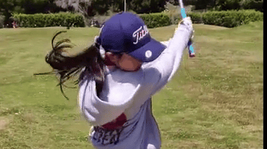

# SG-RIFE: Semantic-Guided Real-Time Intermediate Flow Estimation

[](https://arxiv.org/abs/2512.18241)
[](https://medium.com/@ben.wong9667/semantics-at-speed-supercharging-optical-flow-with-vision-transformers-abac6c1978b3)
[](LICENSE)

**SG-RIFE** bridges the gap between the high throughput of flow-based interpolation (RIFE) and the superior perceptual quality of diffusion-based models.

By injecting dense semantic priors from **DINOv3** through a novel **Deformable Semantic Fusion (DSF)** module, SG-RIFE achieves **diffusion-competitive perceptual quality** (FID: 17.89) while running at **near real-time speeds** (0.05s/frame on L4 GPU)—orders of magnitude faster than current generative approaches.

Enahncement Result: 



---

## 🚀 Core Methodology

The core innovation of SG-RIFE is the effective alignment and injection of high-level semantic features into a pixel-level flow architecture without retraining the backbone.

### 1. Deformable Semantic Fusion (DSF)
Standard optical flow often fails in occluded regions or complex textures (e.g., hair, hands). We introduce **DSF**, a learnable alignment module that uses **Modulated Deformable Convolutions (DCNv2)** to "softly" align static DINOv3 semantic priors with the dynamic motion field.
* **Mechanism**: Predicts residual spatial offsets to correct misalignment between the frozen flow and the actual semantic content.
* **Result**: Eliminates "ghosting" artifacts in fast-moving semantic objects.
* **Code**: `model/dino_modules/dino_fusion.py`

### 2. Split-FAPM (Fidelity Aware Projection)
To handle the high dimensionality of Vision Transformers (384D+) efficiently, we propose the **Split-Fidelity Aware Projection Module**.
* **Compression**: Uses FiLM (Feature-wise Linear Modulation) to compress features to 256D *before* warping to save memory.
* **Refinement**: Applies Squeeze-and-Excitation (SE) blocks *after* warping to restore high-frequency details lost during compression.
* **Code**: `model/dino_modules/dino_adapter.py`

### 3. Parameter-Efficient Fine-Tuning (PEFT)
Instead of retraining the entire flow network (which leads to catastrophic forgetting of motion priors), we freeze the **RIFE** backbone and **DINOv3** extractor. We exclusively train the adapter modules (`Split-FAPM`, `DSF`, and injection layers), updating only **~16%** of the parameters.

---

## 📊 Performance Benchmark

Experiments on the **SNU-FILM (Hard)** benchmark demonstrate that SG-RIFE matches the perceptual quality of state-of-the-art diffusion models while maintaining the speed of flow-based methods.

| Model | Type | Runtime (s) | FID (↓) | LPIPS (↓) |
| :--- | :--- | :--- | :--- | :--- |
| **RIFE (Base)** | Flow | 0.01 | 23.32 | 0.066 |
| **LDMVFI** | Diffusion | 4.50+ | 26.52 | 0.060 |
| **Consec. BB** | Diffusion | 3.00+ | 18.59 | 0.047 |
| **SG-RIFE (Ours)** | **Hybrid** | **0.05** | **17.89** | **0.047** |

> **Analysis**: SG-RIFE outperforms LDMVFI in FID by a margin of 8.62 and reaches numerical parity with Consec. BB, proving that **semantic consistency enables flow-based methods to achieve diffusion-level quality.**

---

## 🛠️ Installation

```bash
git clone https://github.com/ben813/sg-rife.git
cd sg-rife
pip3 install -r requirements.txt
```
* Download the DINOv3 weights from [here](https://github.com/facebookresearch/dinov3) and move it to dinov3_checkpoint/*
* Download the checkpoint from [here](https://drive.google.com/drive/folders/11OVW2MQUXK6MgkPuJJJNubinBlMXADlP?usp=sharing) and move it to train_log_dino/*
* Set the correct dino model name and path in `dino_config.py`.

## 💻 Usage
```bash
python3 inference_img_dino.py --img img0.png img1.png --exp=4
```
2^4=16X interpolation results

## 📜 Citation
If you find our work on Deformable Semantic Fusion or Split-FAPM useful, please cite:
```bibtex
@article{wong2025sg,
  title={SG-RIFE: Semantic-Guided Real-Time Intermediate Flow Estimation with Diffusion-Competitive Perceptual Quality},
  author={Wong, Pan Ben and Wu, Chengli and Lu, Hanyue},
  journal={arXiv preprint arXiv:2512.18241},
  year={2025}
}
```

## ⚖️ Acknowledgements

We stand on the shoulders of giants. This project integrates ideas from the following excellent research:

* **Base Architecture**: [RIFE: Real-Time Intermediate Flow Estimation](https://github.com/hzwer/ECCV2022-RIFE) (ECCV 2022) - *The core optical flow backbone.*
* **Semantic Backbone**: [DINOv3: Vision Transformer](https://github.com/facebookresearch/dinov3) (Meta AI) - *Foundation model for dense semantic features.*
* **Adapter Design**: [Dino U-Net](https://github.com/yifangao112/DinoUNet) - *Inspiration for the Split-FAPM adapter and multi-scale feature injection.*
* **Alignment Module**: [EDVR](https://arxiv.org/abs/1905.02716) & [BasicVSR++](https://arxiv.org/abs/2104.13371) - *Foundational work on Deformable Convolutions (DCNv2) adapted here for our Deformable Semantic Fusion (DSF).*